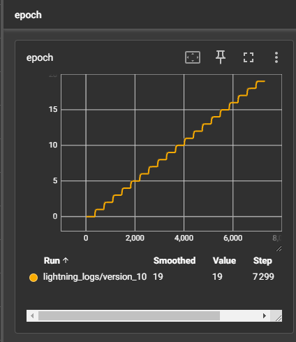
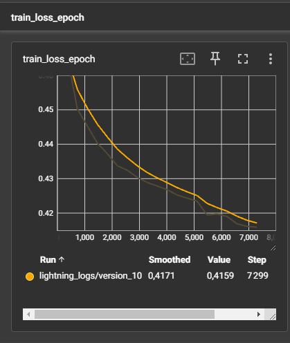
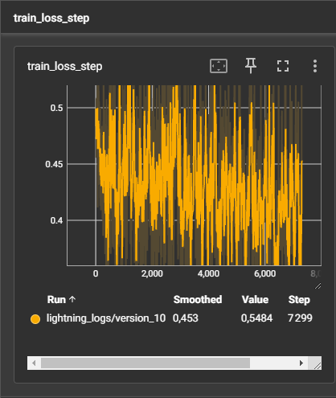
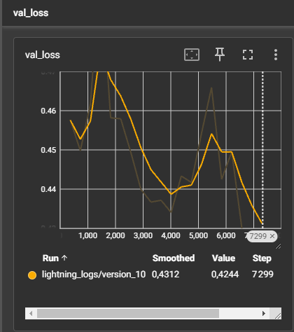

# Document Detector (doc_detector_pl)

**Repository** : [https://github.com/AntoineBendafiSchulmann/doc_detector_pl](https://github.com/AntoineBendafiSchulmann/doc_detector_pl)

## Description du Projet

Le projet **Document Detector** utilise **PyTorch Lightning** pour entraîner un modèle de détection basé sur l'architecture UNet. Il permet de détecter, segmenter et recadrer automatiquement des documents dans des images. Le projet est organisé pour un environnement d'entraînement et d'évaluation flexible, en exploitant TensorBoard pour visualiser les courbes d'entraînement et OpenCV pour le traitement des masques.

---

## Structure du Projet

- **`data/`** : Données utilisées pour l'entraînement et les tests.
  - `images/` : Images d'entraînement.
  - `masks/` : Masques d'entraînement correspondants.
  - `test_images/` : Images de test pour vérifier les performances du modèle.

- **`models/`** : Fichiers des modèles sauvegardés :
  - `.pth` : Modèle PyTorch (format entraînable).
  - `.onnx` : Modèle exporté pour l'inférence.

- **`outputs/`** : Comparaisons générées entre les images originales, les masques attendus, les prédictions, et les recadrages.

- **`logs/`** : Fichiers de logs générés par PyTorch Lightning pour le suivi via TensorBoard.

- **Scripts principaux** :
  - `generate_masks.py` : Génère des masques à partir des images d'entraînement.
  - `train_model.py` : Lance l'entraînement du modèle.
  - `test_model.py` : Effectue une prédiction sur les images de test, génère les comparaisons, et recadre les images.

---

## Installation et Configuration

1. **Cloner le dépôt** :
   ```bash
   git clone https://github.com/AntoineBendafiSchulmann/doc_detector_pl
   cd doc_detector_pl
   ```

2. **Installer les dépendances** :
   ```bash
    pip install -r requirements.txt
   ```

    #### Attention -> à lire !!!
   j'ai généré un fichier ```requirements.txt``` contenant la liste des dépendances installées sur mon environnement virtuel python (il se peut qu'il y ait des trucs pertinent pour moi dedans  genre certaines bibliothèques comme ```pytorch-triton-rocm``` ou ```jax``` pour les gpu amd désolé)

   ceci est la commande :

    ```bash
   pip freeze > requirements.txt
    ```


## Utilisation

### Entraîner le Modèle
Dans le terminal principal, exécutez la commande suivante pour lancer l'entraînement :

```bash
python train_model.py
```

Ouvrez un deuxième terminal, placez-vous dans le dossier ```doc_detector_pl``` et exécutez**:

```bash
tensorboard --logdir logs/ --bind_all
```
ouvrez l'url pour accéder à TensorBoard

### - Résultats générés :
- Les courbes d'entraînement sont visibles dans TensorBoard.
- Le modèle entraîné est sauvegardé dans le dossier models/.

###  Génération des Masques
Pour préparer les données d'entraînement, des masques correspondant aux documents présents dans les images sont générés à l'aide du script ```generate_masks.py```. Les masques servent de cibles pour l'entraînement du modèle

```bash
python generate_masks.py
```

####  Fonctionnement
Le script utilise OpenCV pour détecter automatiquement les documents dans les images. Voici les étapes principales :

- Floutage des Images : Utilise un flou gaussien pour réduire les bruits.
- Seuil adaptatif : Applique une méthode de seuil adaptatif pour séparer le fond des zones importantes.
- Contours : Identifie les contours dans l'image.
- Filtrage : Retient uniquement les contours ayant :
#####  - Quatre côtés (approximé comme un quadrilatère).
###### -Une aire minimale (par défaut, > 1000 pixels).
#####  -Masque Final : Dessine le quadrilatère détecté.

#### Les masques générés sont sauvegardés dans le dossier ```data/masks/```

### Tester le Modèle
Testez le modèle sur une image de test et générez des comparaisons visuelles :

```bash
python test_model.py
```

####  Sorties générées :
- Les comparaisons (image originale, masque attendu, masque prédit, image recadrée) sont sauvegardées dans ```outputs/```.


### Explication des Courbes TensorBoard et Analyse des Risques

Les courbes affichées dans TensorBoard sont des outils essentiels pour suivre et comprendre l'entraînement du modèle. Elles permettent d'identifier les progrès réalisés mais aussi de détecter des problèmes comme l'overfitting.


#### 1. Progression des Époques (epoch)

- Description : Cette courbe indique le nombre d'époques complétées au fur et à mesure de l'entraînement.
##### - Interprétation :
- Elle sert simplement à visualiser la progression. Une augmentation linéaire est attendue et normale.



#### 2. Perte Moyenne par Époque (train_loss_epoch)

- Description : Cette courbe montre comment la "perte", une mesure de l'erreur entre la prédiction du modèle et les résultats attendus, évolue à chaque époque (un passage complet de toutes les images du jeu d'entraînement dans le modèle).
##### - Interprétation :
- Une courbe qui diminue régulièrement indique que le modèle apprend bien.
- Si la perte stagne ou augmente après une phase de diminution, cela peut signaler que le modèle atteint sa capacité maximale ou commence à mémoriser les données (overfitting).




#### 3. Perte à Chaque Étape de Traitement (train_loss_step)

- Description : Cette courbe montre les variations de la perte après chaque groupe d'images (mini-lot ou "batch") traité par le modèle.
##### - Interprétation :
- De légères fluctuations sont normales et reflètent la diversité des données.
- Une tendance globale à la baisse est un bon signe. Cependant, si les variations sont trop importantes ou ne diminuent pas, cela peut indiquer que l'apprentissage est instable.



####  4. Perte sur les Données de Validation (val_loss)
- Description :
Cette courbe représente l'évolution de la perte (ou erreur) calculée sur les données de validation après chaque époque. Contrairement à la perte d'entraînement, la perte de validation mesure la capacité du modèle à généraliser sur des données qu'il n'a jamais vues auparavant.

#####  - Interprétation :
- Tendance à la baisse : Si la courbe diminue régulièrement, cela signifie que le modèle apprend à bien généraliser sur de nouvelles données.
- Augmentation ou stagnation : Si la courbe stagne ou augmente alors que la perte d'entraînement continue de diminuer, cela peut indiquer un début d'overfitting.
- Oscillations : Une légère variation est normale. Cependant, des fluctuations importantes peuvent refléter une instabilité dans l'apprentissage ou un jeu de validation trop petit.(dans mon cas actuel il se pouurait qu'on soit pas bon xd)




### Le Risque d'Overfitting : Comprendre et Éviter

##### Qu'est-ce que l'overfitting ?
L'overfitting se produit lorsque le modèle apprend trop bien sur les données d'entraînement, au point de mémoriser des détails spécifiques qui ne se généralisent pas à de nouvelles données. Cela se traduit par une bonne performance sur les données d'entraînement, mais de mauvaises performances sur des données jamais vues auparavant. Voici quelques techniques pour éviter ce problème

#####  Signes d'overfitting dans TensorBoard :
- Augmentation de la val_loss : Si la courbe de validation (val_loss) commence à augmenter ou stagner alors que la perte d'entraînement (train_loss) continue de diminuer, cela indique que le modèle mémorise les données d'entraînement sans généraliser correctement.
- Écart significatif entre train_loss et val_loss : Une différence importante entre la perte d'entraînement (très faible) et la perte de validation (plus élevée) reflète un sur-apprentissage sur les données d'entraînement.
- Fluctuations importantes de val_loss : De grandes oscillations peuvent indiquer que le modèle est instable ou que les données de validation ne sont pas représentatives.


### Fonctionnalité de Recadrage Automatique

Le script ```test_model_and_crop``` permet d'effectuer une prédiction sur une image de test et de recadrer automatiquement le document détecté en fonction du masque prédit par le modèle UNet. Cette étape simule comment le modèle peut être utilisé dans un pipeline complet quand le modèle sera exporté sur tensorflow js pour être utilisable sur un navigateur, allant de la détection à l'extraction ciblée d'un document.


#### Étapes de Fonctionnement :
1. Chargement de l'image et du masque attendu :

- L'image de test est lue et préparée pour être passée dans le modèle.
- Un masque attendu peut également être utilisé pour comparaison. 

2. Prédiction du masque :
- Le modèle génère un masque binaire prédisant les zones correspondant au document.

3. Redimensionnement du masque :

- Le masque prédit est redimensionné pour correspondre aux dimensions originales de l'image.

4. Détection et recadrage :

- À l'aide des coordonnées du masque prédit, la zone correspondant au document est recadrée automatiquement.

5. Visualisation et sauvegarde :

###### - Quatre images sont générées :
- L'image originale
- Le masque attendu
- Le masque prédit
- L'image recadrée

#### - Ces résultats sont sauvegardés dans le dossier ```outputs/```.
Exemple de Commande :
Pour tester cette fonctionnalité, exécutez simplement la commande suivante :

```bash
python test_model.py
```
Exemple de Résultats :


Voici la sortie générée par ce script :

- Image originale : Affiche l'image d'entrée brute.
- Masque attendu : Masque manuel utilisé pour l'entraînement.
- Masque prédit : Généré automatiquement par le modèle.
- Image recadrée : Image finale extraite en fonction des prédictions

### Intégration en Production

Le modèle entraîné peut être exporté dans différents formats comme ONNX ou TensorFlow.js, permettant son utilisation dans des systèmes backend ou frontend.
- **ONNX** : Permet l'intégration avec des frameworks comme ONNX Runtime pour des prédictions rapides.
- **TensorFlow.js** : Rendra le modèle directement utilisable dans les navigateurs.